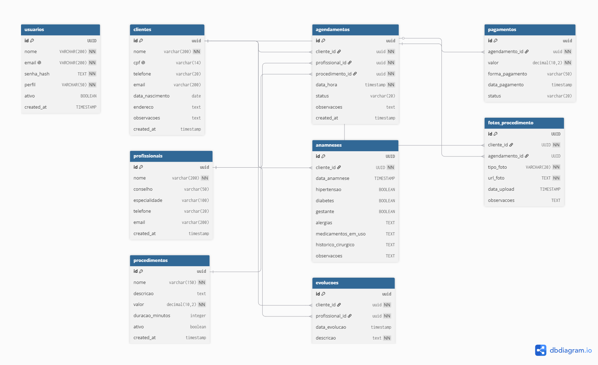

# Sistema de Prontuário Eletrônico para Clínica de Estética

Projeto desenvolvido para estudo de:

- PostgreSQL
- Modelagem de Dados
- SQL
- Git/GitHub

## Modelo Entidade-Relacionamento

## Entidades

- Clientes
- Profissionais
- Procedimentos
- Agendamentos
- Evoluções
- Anamneses
- Pagamentos

- ## Tecnologias

- PostgreSQL
- GitHub
- Power BI (em desenvolvimento)
